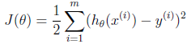
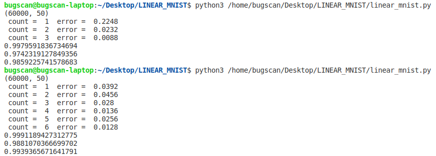
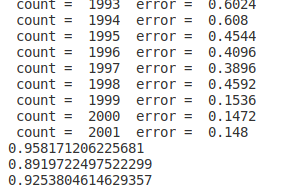

## 模式识别第二次实验

### 邹永浩 2019211168

#### 1. 预处理

数据处理与上次实验类似，先进行PCA降维，不过降维后只取数据中的两组进行后续计算

```python
train_data = tools.get_train_data()
train_label = tools.get_train_label()
dimension = 50
train_data, eigenVectors = pca.PCA(train_data, dimension)

# 10 classes
classified_data = []
for i in range(10):
    classified_data.append([])

for i in range(len(train_label)):
    # print(train_label[i][0])
    classified_data[train_label[i][0]].append(train_data[i])

# 训练数据为制定的两类数字
train_data1 = classified_data[num1]
train_data2 = classified_data[num2]
```

#### 2.线性分类器 (linear.py)

与极大似然估计不同，线性分类器需要设置一些参数

```python
def __init__(self):
    # 学习率的初始值
    self.learn_speed_start = 0.1
    # 学习率
    self.learn_speed = 0.0
    # 偏置
    self.b = 1
    # 最小误差精度
    self.min_error_signal = 0.05
    # 衰减因子
    self.r = 5.0
    # 训练次数
    self.train_count = 100
```

训练时使用的误差函数为



那么根据这个误差函数，梯度的计算方式如下为

```python
# 二分类
def sgn(self, v):
    if v > 0:
        return 1
    else:
        return -1

# 根据当前参数计算分类
def get_sgn(self, current_weight, current_train_data):
    return self.sgn(np.dot(current_weight.T, current_train_data))

# 计算误差
def get_error_signal(self, current_weight, current_train_data, current_class):
    return current_class - self.get_sgn(current_weight, current_train_data)

# 更新权重
def update_weight(self, old_weight, current_train_data, current_class, current_learn_speed, current_train_count):
    current_error_signal = self.get_error_signal(
        old_weight, current_train_data, current_class)
    # 更新学习率
    self.learn_speed = self.learn_speed_start / \
        (1 + (current_train_count / float(self.r)))
    # 更新参数，梯度为current_error_signal * current_train_data
    new_weight = old_weight + \
        (current_learn_speed * current_error_signal * current_train_data)
    return new_weight
```

训练时，每次随机抽取一批数据计算梯度值，然后计算误差值，这样可以在性能不降低的情况下提高计算速度

```python
def train(self):
    self.train_data = np.array(self.train_data)
    self.data_classes = np.array(self.data_classes)
    # 初始化权值
    for i in range(len(self.train_data[0]) - 1):
        self.weight.append(0.0)
    self.weight = np.array(self.weight)
    current_count = 0
    while True:
        error_signal = 0
        i = 0

        # 抽取一个批次
        for j in range(0, 3000):
            # print(j)
            i = random.randint(0, len(self.train_data) - 1)
            current_error_signal = self.get_error_signal(
                self.weight, self.train_data[i], self.data_classes[i])
            self.weight = self.update_weight(
                self.weight, self.train_data[i], self.data_classes[i], self.learn_speed, current_count)

        # 计算当前误差
        for j in range(0, len(self.train_data) - 1):
            current_error_signal = self.get_error_signal(
                self.weight, self.train_data[j], self.data_classes[j])
            error_signal += math.pow(current_error_signal, 2)
        error_signal = error_signal / len(self.train_data)
        current_count += 1

        if abs(error_signal) < self.min_error_signal:
            break
        if current_count > self.train_count:
            break
```


#### 3. 整体流程

```python

# 原始数据降维，略

# 设置分类器参数
linear_classifier = linear.LinearClassification()
linear_classifier.add_train_data(train_data1, 1)
linear_classifier.add_train_data(train_data2, -1)
linear_classifier.learn_speed_start_init(0.1)
linear_classifier.r_init(1000)
linear_classifier.train_count_init(2000)
linear_classifier.min_error_signal_init(0.01)

# 开始训练
linear_classifier.train()

# 测试数据降维，略

# 分类并查看结果
test_data1 = classified_test_data[num1]
test_data2 = classified_test_data[num2]

correct1 = 0
count1 = 0
for i in range(len(test_data1)):
    count1 += 1
    predict = linear_classifier.classify(test_data1[i])
    if predict == 1:
        correct1 += 1
# 第一类准确率
print(correct1 / len(test_data1))

correct2 = 0
count2 = 0

for i in range(len(test_data2)):
    count2 += 1
    predict = linear_classifier.classify(test_data2[i])
    if predict == -1:
        correct2 += 1

# 第二类准确率
print(correct2 / len(test_data2))

# 整体准确率
print((correct1 + correct2) / (len(test_data2) + len(test_data1)))
```

#### 4. 测试结果

大部分数字效果极好，例如 0， 1； 1， 9； 3， 4等只训练几次即可达到非常好的分类效果：



有两个数字 7,9 在测试中表现没有其他数字好，一般准确率为94左右：



可见有些数据集在线性分类上可能效果一般，而影响的因素包括是降维的维度、参数的调整、数据的预处理等。

#### 5. 总结

线性分类器可以较好的完成此分类任务，但是本实验只实现了二分类，后续可以继续探索多分类的情况。同时对于一些特殊数据集应该调整分类参数、迭代次数或者数据预处理的方法等。本次实验由于时间仓促，未进行多种预处理方法的测试，后续应学习这些方法的应用。